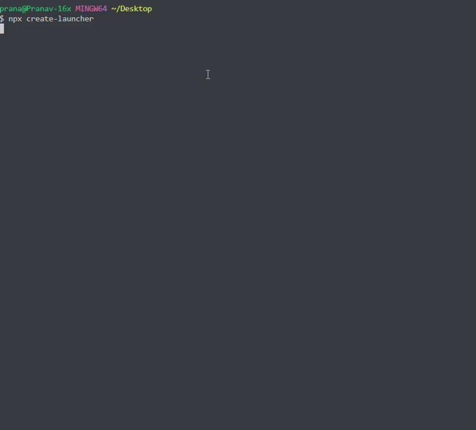

# Create Launcher

<p align="center">A modern zero config CLI tool to quickly scaffold new projects with popular frameworks and configurations.</p>

<div  align="center">
  
</div>
<br/>

<p align="center">
  <a href="https://www.npmjs.com/package/create-launcher">
    
  </a>
  <a href="https://github.com/pranav89624/create-launcher/blob/main/LICENSE">
    
  </a>
  
  
</p>

## ✨ Features

<table>
<tr>
<td width="50%">

### 🚀 **Fast & Interactive**

- ⚡ Interactive CLI prompts
- 📦 Zero configuration required
- 🎯 Smart template selection
- 🔧 Auto dependency installation

</td>
<td width="50%">

### 🎨 **Multiple Templates**

- 🏗️ **Vanilla JS/TS** - Pure web development
- ⚛️ **React** - Modern React with Vite
- 🌟 **Next.js** - Full-stack React framework
- 📝 **11ty** - Static site generator

</td>
</tr>
<tr>
<td>

### ⚙️ **Smart Configuration**

- 📘 TypeScript support
- 🎨 Tailwind CSS integration
- 🧹 ESLint pre-configured
- 📋 Build tools included

</td>
<td>

### 📦 **Package Manager Choice**

- 📥 npm (default)
- 🧶 yarn
- ⚡ pnpm

</td>
</tr>
</table>

## 🚀 Quick Start

### <strong>📥 Installation Options</strong>

#### Option 1: NPX (Recommended)

```bash
npx create-launcher
```

#### Option 2: Global Installation

```bash
npm install -g create-launcher
create-launcher
```

## 🎬 See It In Action

<p align="center">
  
</p>

<p align="center"><em>⚡ Creating a React + TypeScript + Tailwind project in under 30 seconds</em></p>

## Usage

1. Run the command
2. Enter your project name
3. Select a template
4. Choose TypeScript (if supported)
5. Choose Tailwind CSS (if supported)
6. Your project will be created and ready to go!

## 📋 Available Templates

<table>
<thead>
<tr>
<th>🎨 Template</th>
<th>📘 TypeScript</th>
<th>🎨 Tailwind</th>
<th>📝 Description</th>
<th>⚡ Bundler</th>
</tr>
</thead>
<tbody>
<tr>
<td><strong>Vanilla</strong></td>
<td>✅</td>
<td>✅</td>
<td>Pure HTML/CSS/JS project</td>
<td>Vite</td>
</tr>
<tr>
<td><strong>React</strong></td>
<td>✅</td>
<td>✅</td>
<td>Modern React application</td>
<td>Vite</td>
</tr>
<tr>
<td><strong>Next.js</strong></td>
<td>✅</td>
<td>✅</td>
<td>Full-stack React framework</td>
<td>Next.js</td>
</tr>
<tr>
<td><strong>11ty</strong></td>
<td>❌</td>
<td>🔄*</td>
<td>Static site generator</td>
<td>11ty</td>
</tr>
</tbody>
</table>

<p><em>*Tailwind can be manually added later</em></p>

## 🏆 Why Choose Create Launcher?

- ⚡ **Fastest** setup - under 30 seconds
- 🎯 **Battle-tested** templates
- 🔄 **Always updated** dependencies
- 🛠️ **Zero configuration** required

## 🔮 Coming Soon

- **Vue.js** templates with Vite
- **Svelte** support with SvelteKit
- **Angular** starter templates

## 🎮 Try It Now!

[](https://stackblitz.com/github/pranav89624/create-launcher)
[](https://github.dev/pranav89624/create-launcher)

## Development

```bash
# Clone the repository
git clone https://github.com/pranav89624/create-launcher.git
cd create-launcher

# Install dependencies
npm install

# Build the project
npm run build

# Test locally
npm run dev
```

## Contributing

Contributions are welcome! Please read [`CONTRIBUTING.md`](./CONTRIBUTING.md) for setup instructions and contribution guidelines.

## 📄 License

MIT License - see [`LICENSE`](./LICENSE) file for details.

## 📋 Changelog

All notable changes to this project will be documented in the [`CHANGELOG.md`](./CHANGELOG.md).

---

<p align="center">
  <strong>Made with ❤️ by <a href="https://github.com/pranav89624">Pranav Verma</a></strong>
</p>

<p align="center">
  <a href="#create-launcher">⬆️ Back to top</a>
</p>
